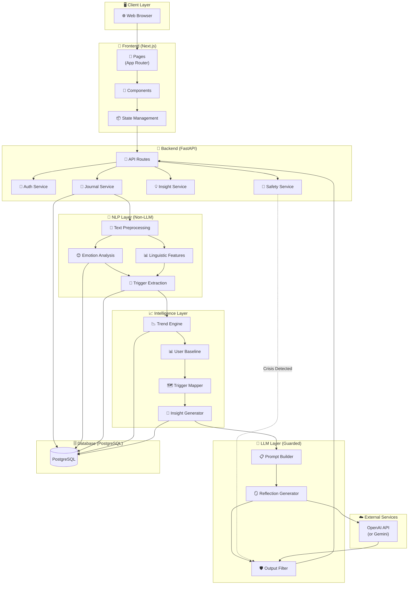
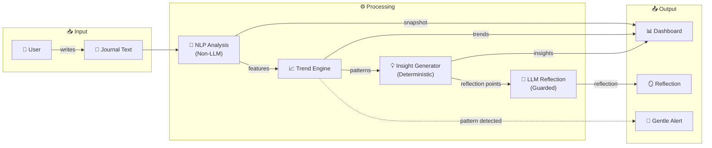
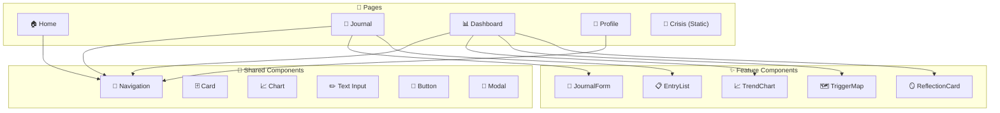
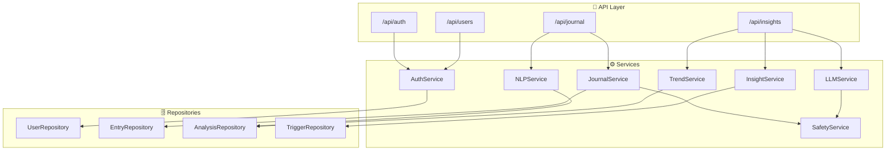
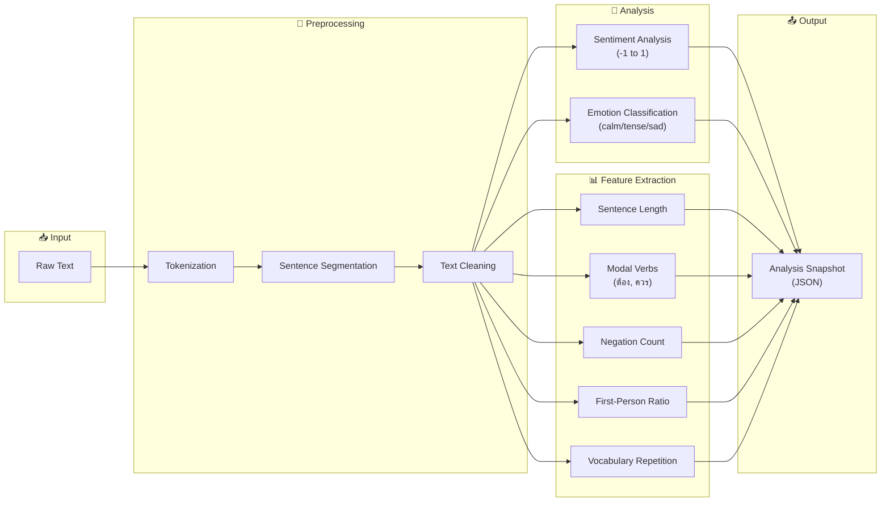
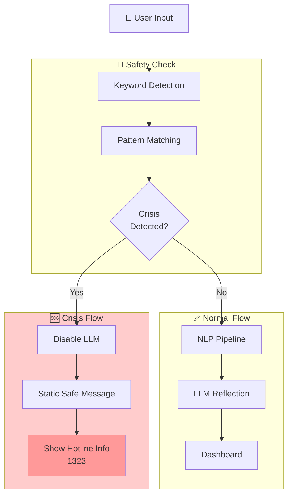
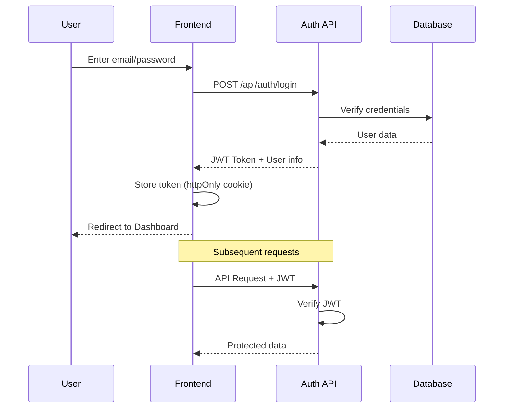
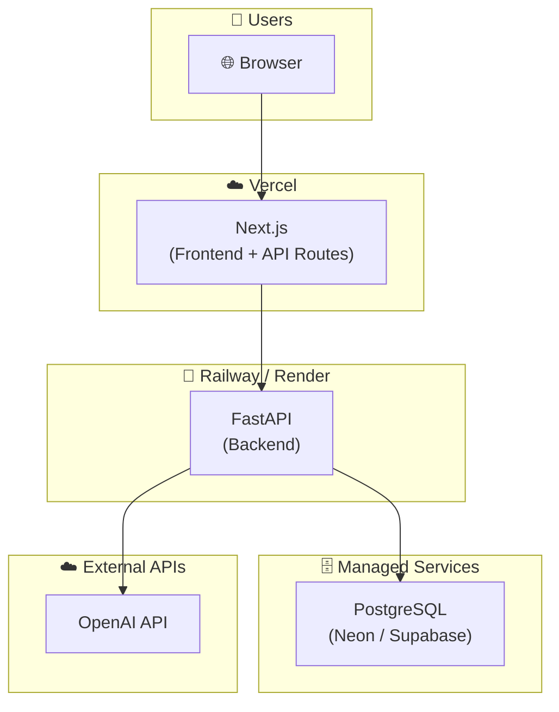

# 🏗️ System Architecture — Reflect Mental Health AI Web App

เอกสารนี้แสดง Architecture Diagram และ Data Flow ของระบบ

---

## 🎯 Architecture Overview

---

## 🔄 Data Flow Diagram

---

## 🧩 Component Architecture

### Frontend Components

---

### Backend Services

---

## 🧠 NLP Pipeline Detail

---

## 🚨 Safety Flow

---

## 🔐 Authentication Flow

---

## 📦 Deployment Architecture

---

## 🔑 Key Design Decisions

| Decision | Rationale |
|----------|-----------|
| **Separate NLP from LLM** | NLP ให้ผลที่อธิบายได้ / LLM ใช้แค่สะท้อน |
| **Trend-based, not state-based** | ไม่ตัดสินสถานะปัจจุบัน แค่ดูแนวโน้ม |
| **User baseline comparison** | เปรียบเทียบกับตัวเอง ไม่ใช่คนอื่น |
| **Safety-first architecture** | เช็ค crisis ก่อน LLM เสมอ |
| **Deterministic insight first** | สร้าง insight จาก rules ก่อนส่งให้ LLM |

---

## 📐 API Endpoints (MVP)

| Method | Endpoint | Description |
|--------|----------|-------------|
| POST | `/api/auth/register` | สมัครสมาชิก |
| POST | `/api/auth/login` | เข้าสู่ระบบ |
| POST | `/api/auth/logout` | ออกจากระบบ |
| GET | `/api/journal` | ดึง journal entries |
| POST | `/api/journal` | สร้าง journal entry |
| GET | `/api/journal/:id` | ดึง entry เฉพาะ |
| DELETE | `/api/journal/:id` | ลบ entry |
| GET | `/api/insights/trends` | ดึงแนวโน้ม |
| GET | `/api/insights/triggers` | ดึง trigger map |
| GET | `/api/insights/reflection` | ดึง AI reflection |
| GET | `/api/users/me` | ข้อมูล user |
| PATCH | `/api/users/me` | อัปเดต profile |
| DELETE | `/api/users/me` | ลบ account |
