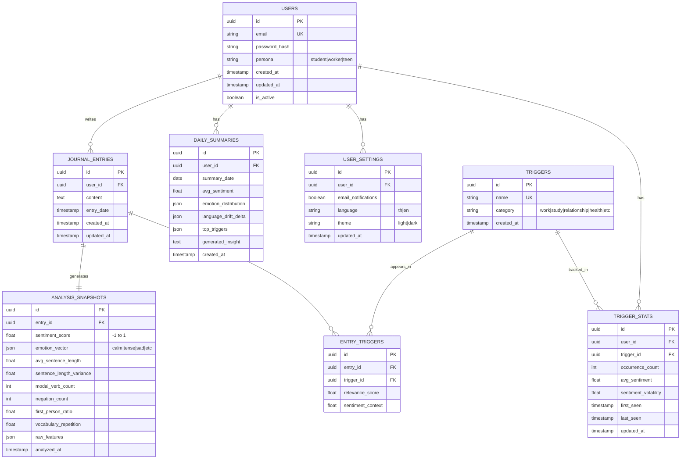

# 🗄️ Database Schema — Reflect Mental Health AI Web App

เอกสารนี้แสดง ER Diagram และรายละเอียด Database Schema

---

## 📊 ER Diagram



---

## 📋 Table Descriptions

### 1. `users`
ข้อมูลผู้ใช้พื้นฐาน

| Column | Type | Description |
|--------|------|-------------|
| id | UUID | Primary key |
| email | VARCHAR | Email (unique) |
| password_hash | VARCHAR | Hashed password |
| persona | ENUM | student / worker / teen |
| created_at | TIMESTAMP | วันที่สร้าง |
| updated_at | TIMESTAMP | วันที่อัปเดต |
| is_active | BOOLEAN | สถานะ account |

---

### 2. `user_settings`
การตั้งค่าของผู้ใช้

| Column | Type | Description |
|--------|------|-------------|
| id | UUID | Primary key |
| user_id | UUID | FK → users |
| email_notifications | BOOLEAN | รับ email alert |
| language | ENUM | th / en |
| theme | ENUM | light / dark |

---

### 3. `journal_entries`
บันทึก journal ของผู้ใช้

| Column | Type | Description |
|--------|------|-------------|
| id | UUID | Primary key |
| user_id | UUID | FK → users |
| content | TEXT | เนื้อหา journal |
| entry_date | TIMESTAMP | วันที่เขียน |
| created_at | TIMESTAMP | วันที่สร้าง |
| updated_at | TIMESTAMP | วันที่แก้ไข |

---

### 4. `analysis_snapshots`
ผลวิเคราะห์ NLP ของแต่ละ entry (Non-LLM)

| Column | Type | Description |
|--------|------|-------------|
| id | UUID | Primary key |
| entry_id | UUID | FK → journal_entries |
| sentiment_score | FLOAT | -1 (negative) ถึง 1 (positive) |
| emotion_vector | JSON | {"calm": 0.3, "tense": 0.5, ...} |
| avg_sentence_length | FLOAT | ความยาวประโยคเฉลี่ย |
| sentence_length_variance | FLOAT | ความแปรปรวนความยาว |
| modal_verb_count | INT | จำนวนคำ modal (ต้อง, ควร) |
| negation_count | INT | จำนวนคำปฏิเสธ |
| first_person_ratio | FLOAT | สัดส่วนสรรพนามบุคคลที่ 1 |
| vocabulary_repetition | FLOAT | ความซ้ำของคำศัพท์ |
| raw_features | JSON | ข้อมูล features ดิบทั้งหมด |
| analyzed_at | TIMESTAMP | เวลาวิเคราะห์ |

> ❗ ไม่มี field ที่เป็น medical label เช่น "depression_score"

---

### 5. `daily_summaries`
สรุปรายวันสำหรับ dashboard

| Column | Type | Description |
|--------|------|-------------|
| id | UUID | Primary key |
| user_id | UUID | FK → users |
| summary_date | DATE | วันที่สรุป |
| avg_sentiment | FLOAT | sentiment เฉลี่ยของวัน |
| emotion_distribution | JSON | การกระจายอารมณ์ |
| language_drift_delta | JSON | การเปลี่ยนแปลงจาก baseline |
| top_triggers | JSON | triggers ที่พบบ่อย |
| generated_insight | TEXT | insight ที่สร้างขึ้น |
| created_at | TIMESTAMP | เวลาสร้าง |

---

### 6. `triggers`
รายการ triggers/หัวข้อที่ระบบรู้จัก

| Column | Type | Description |
|--------|------|-------------|
| id | UUID | Primary key |
| name | VARCHAR | ชื่อ trigger (unique) |
| category | VARCHAR | หมวดหมู่ |
| created_at | TIMESTAMP | เวลาสร้าง |

**ตัวอย่าง Triggers:**
- งาน (work)
- การเรียน (study)
- ความสัมพันธ์ (relationship)
- สุขภาพ (health)
- ครอบครัว (family)
- การเงิน (finance)

---

### 7. `entry_triggers`
Junction table: เชื่อม entry กับ triggers

| Column | Type | Description |
|--------|------|-------------|
| id | UUID | Primary key |
| entry_id | UUID | FK → journal_entries |
| trigger_id | UUID | FK → triggers |
| relevance_score | FLOAT | ความเกี่ยวข้อง 0-1 |
| sentiment_context | FLOAT | sentiment ขณะพูดถึง trigger นี้ |

---

### 8. `trigger_stats`
สถิติ triggers ต่อผู้ใช้ (สำหรับ Trigger Map)

| Column | Type | Description |
|--------|------|-------------|
| id | UUID | Primary key |
| user_id | UUID | FK → users |
| trigger_id | UUID | FK → triggers |
| occurrence_count | INT | จำนวนครั้งที่พบ |
| avg_sentiment | FLOAT | sentiment เฉลี่ย |
| sentiment_volatility | FLOAT | ความผันผวนของ sentiment |
| first_seen | TIMESTAMP | พบครั้งแรก |
| last_seen | TIMESTAMP | พบครั้งล่าสุด |

---

## 🔐 Design Principles

1. **❌ No Medical Labels** — ไม่มี field เช่น `depression_score`, `anxiety_level`
2. **✅ Store Features, Not Conclusions** — เก็บข้อมูลดิบ ไม่เก็บ diagnosis
3. **✅ Time-Series Friendly** — schema รองรับการวิเคราะห์แนวโน้มตามเวลา
4. **✅ User Data Ownership** — ผู้ใช้ลบข้อมูลทั้งหมดของตัวเองได้ (cascade delete)
5. **✅ Privacy-First** — เก็บเฉพาะข้อมูลที่จำเป็น

---

## 📝 Indexes (Performance)

```sql
-- Fast lookup by user
CREATE INDEX idx_journal_entries_user_id ON journal_entries(user_id);
CREATE INDEX idx_daily_summaries_user_date ON daily_summaries(user_id, summary_date);
CREATE INDEX idx_trigger_stats_user_id ON trigger_stats(user_id);

-- Time-based queries
CREATE INDEX idx_journal_entries_entry_date ON journal_entries(entry_date);
CREATE INDEX idx_analysis_snapshots_analyzed_at ON analysis_snapshots(analyzed_at);
```

---

## 🔄 Data Flow

```
User writes journal
       ↓
journal_entries (stored)
       ↓
NLP Pipeline runs
       ↓
analysis_snapshots (stored)
       ↓
Trigger extraction
       ↓
entry_triggers (stored)
       ↓
Daily aggregation job
       ↓
daily_summaries (stored)
trigger_stats (updated)
       ↓
Dashboard reads data
```
